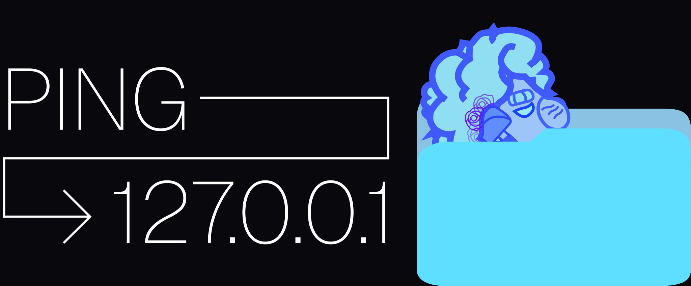
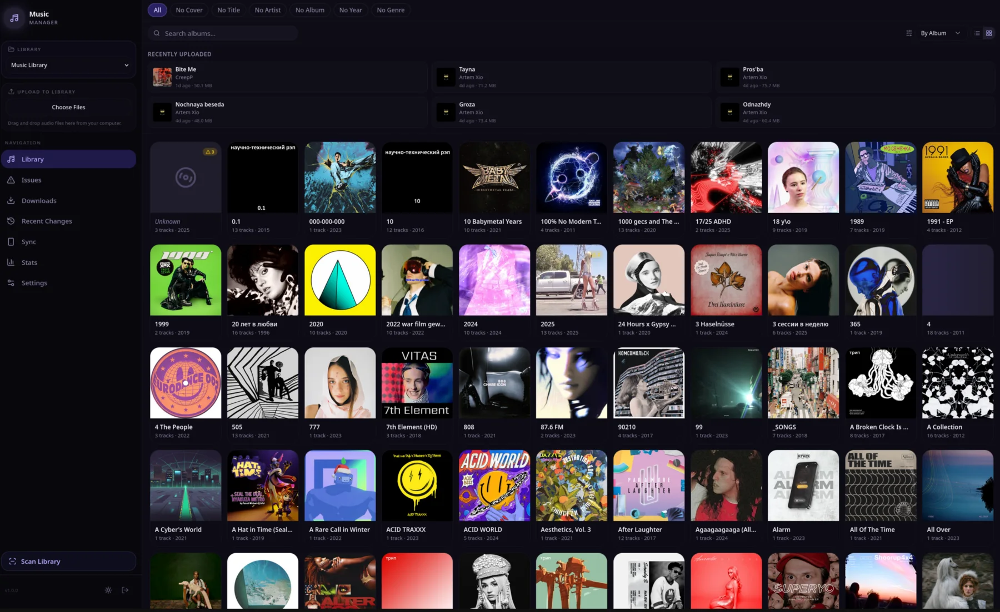
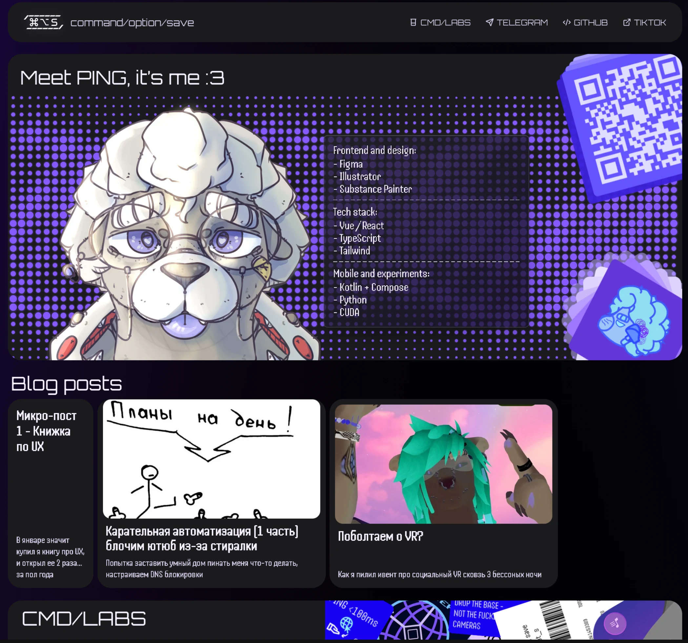

  

  <a href="README.md">English version</a>

## Обо мне

Привет, я Пинг. В основном работаю с вебом, хотя иногда тыкаю ML. Основные направления моей работы:

- **Machine Learning** - эксперименты с ASR, пайплайнами компьютерного зрения и интеграцией с реальным оборудованием.
- **Веб-дизайн** - создание выразительных адаптивных сайтов и инструментов с вниманием к визуальным деталям и взаимодействию.

## Мой стек

## Проекты

### Museal (пока что приватный, будет открыт в ~ноябре 2026)

Селфхостинговый менеджер музыкальной библиотеки для организации, исправления и пополнения личной коллекции. Museal объединяет сканирование библиотеки и работу с метаданными (Musicbrainz, яндекс музыка, qoubuz и другие), поиск и загрузку музыки из внешних источников, интеграцию с Navidrome, статистику, поиск дубликатов, синхронизацию с iPod.

    

### [PingTheSeal](https://pingtheseal.com)

Мой личный сайт, который я спроектировал и разработал как пространство для своих проектов, текстов, музыки и экспериментов. Делался как развлекалово с дизайном

    

## Вклад в open source

### [Alina](https://github.com/ShiftlineHQ/alina)

Open-source ИИ-ассистент от Shiftline. Работал над самой первой версией, дальше в основном работал над голосовым пайплайном и бекэндом

### [quasistreaming-gigam](https://github.com/v3rt3p/quasistreaming-gigam)

Также я являюсь контрибьютором quasistreaming-gigam - проекта для потокового распознавания речи для умных колонок на базе GigaAM.
